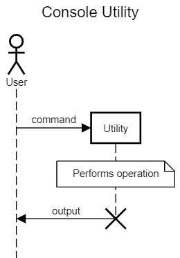

## Easier Console Utilities in .NET Core

Jack Alvrus

---

### About Me

#### Jack Alvrus
* Full stack developer and occasional architect
* e-Commerce - CaptiveAire Systems

---

### ASP.NET Core

* Web applications and APIs
* Constructed using a host builder
* Includes several helpful features

---

---

---

### Console Utility

Application that is invoked by a command line, performs an operation then terminates.

* Are supported by .NET Core
* Not as well supported as web applications
* Template does not include helpful features
* Challenging to use services created for web applications

---

---

### Implementation Options

* Manually implement required features
* Adapt parts of web application ecosystem

---

### Basic Example Using Host Builder

---

---

### What's Missing?

* Application lifecycle management
  * Ctrl+C to trigger CancellationToken
* Command line parsing
  * Multiple operations per utility
  * Command parameters
* Typed configuration
* Environment (development, staging, production)

---

### Application Lifecycle

We already built the host, can we just run it?  
No, doesn't work.

---

### Host Requirements

* Register a hosted service
* Handle differences in lifecycle between web application and console utility

---

### Console Utility Lifecycle

---

### Web Application Lifecycle

---

### Command Line Parsing

* Use a command line parsing NuGet package
* Use the built-in configuration features
  * The command line is a standard configuration source

There are five basic alternative formats for arguments: 
key1=value1 
--key2=value2 
/key3=value3 
--key4 value4 
/key5 value5.

---

### Typed Config and Environment

Web applications access `IConfiguration` and `IHostEnvironment` through the `Startup` class

---

### Advanced Example

* Run the host
* Cancellation token
* Multiple operations per utility
* Command parameters
* Typed configuration
* Environment

---

### More Things to Consider

* Command line part 2
  * Validation
  * Strongly-typed configuration
* Output via Console or ILogger?
* Application vs. Utility
  * Single hosted service
  * IHostApplicationLifetime to implement exit/quit command

---

### Fin

Questions / Comments
